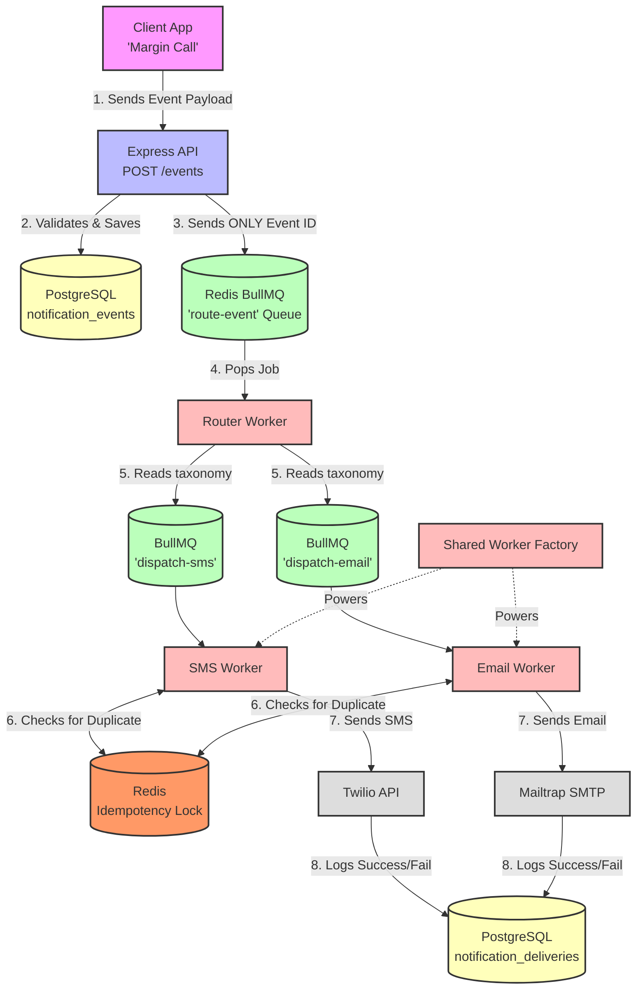

# Notification Engine Architecture (Days 1–6)

Here is the exact journey a notification takes in your system, from the moment a financial event happens to the moment the message reaches the user's phone or inbox.

## The Big Picture (Mermaid Diagram)

---

## Explained in a Simple Way (The Post Office Analogy)

Think of your Notification Engine as a highly efficient modern Post Office. 

### Phase 1: The Front Desk (Day 3 & 4)
* **The Express API**: This is the receptionist. When an application says, "Alice just got a Margin Call," the receptionist uses Zod (a strict ruler) to verify the request is formatted perfectly.
* **The Ledger (PostgreSQL)**: The receptionist immediately writes the full payload down in the heavy, permanent ledger (`notification_events` table) so we never lose it.
* **The Conveyor Belt (BullMQ `route-event`)**: Instead of putting the heavy payload on the belt, the receptionist just puts a tiny sticky note with the **Event ID** on the belt. This keeps the queue lighting fast.

### Phase 2: The Sorting Facility (Day 5)
* **The Router Worker**: This worker picks up the sticky note, looks up the full details in the Ledger, and checks the rulebook (`event-types.json`). 
* If the rulebook says a Margin Call gets both a Text and an Email, the Router clones the sticky note and puts one on the **SMS conveyor belt** and one on the **Email conveyor belt**. This is called "Fan-Out".

### Phase 3: The Delivery Trucks (Day 6)
* **The Shared Factory**: Instead of building a custom truck from scratch for SMS and Email, we built a universal "Chassis" (the Factory). It handles engine basics: fetching the user's contact info, tracking errors, and checking for duplicates.
* **The SMS & Email Workers**: These are the truck drivers. They use the factory chassis. 
* **The Duplicate Shield (Redis Idempotency)**: Before a truck driver leaves the garage, they check the Redis lock. If another truck already delivered this exact message to Alice today, they stop and log a `skipped_duplicate`. This prevents spamming users if the network glitches.

### Phase 4: Proof of Delivery (Day 5 & 6)
* **External Providers (Twilio & Mailtrap)**: The trucks hand the message to the local postman (Twilio/Mailtrap). 
* **The Final Receipt (`notification_deliveries`)**: Whether the postman successfully delivered it or failed (like our Twilio Trial error), the worker records the exact result back into the main PostgreSQL database so customer support can see exactly what happened!
